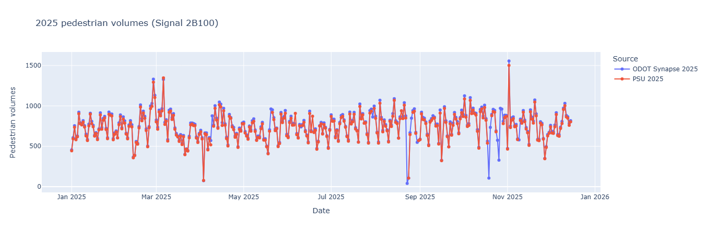
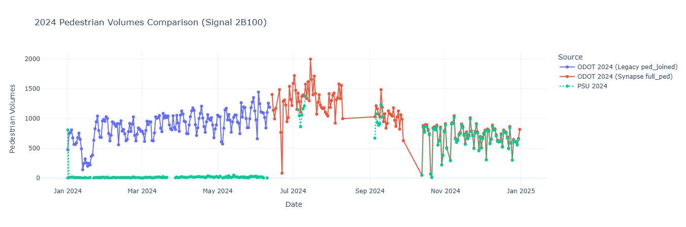
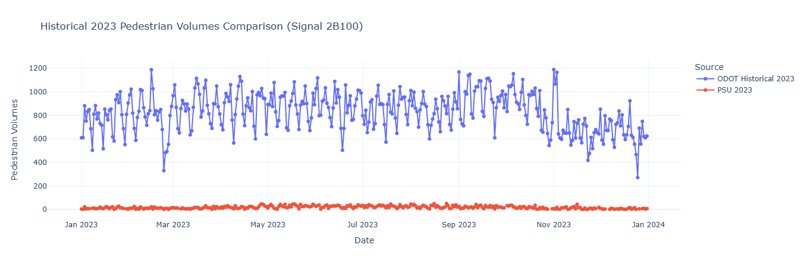
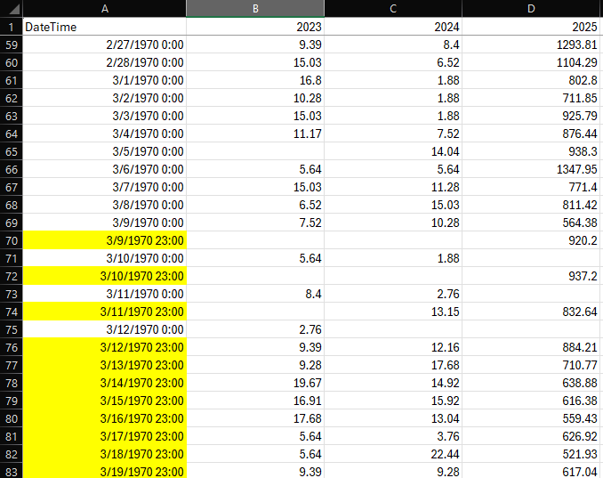
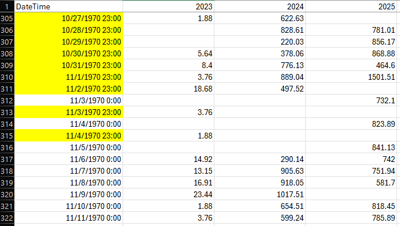

# PSU BikePed Portal Data Anomaly Investigation (Signal 2B100)

Deep dive investigation into Signal 2B100 (US 26 at 92nd). For full analysis, see `investigation.ipynb`.

The notebook performs a focused, signal-level cross-check for device `2B100` by comparing PSU portal daily volumes (`data/PSU_2B100.csv`) to ODOT-derived totals from (a) a 15‑minute Synapse export (`data/2B100_full_ped.csv`) and (b) legacy MaxView parquet sources (deviceid `902`).

## Key Findings & Data Gaps

### 1. Persistent Data Gaps
While PSU and ODOT track closely in 2025 (ODOT slightly higher due to methodology), the PSU series exhibits **intermittent data gaps**. These gaps may be due to inability to catch up on data ingestion when the ODOT data pipeline was temporarily down due to maintenance or problems, which happens occasionally.

### 2. Kinetic Signals Transition Instability (2024)
There was a ~6-month period of significant instability following the launch of Kinetic Signals (mid-2024). During this transition:
* The data processing pipeline regularly dropped or duplicated a few time time periods per day.
* Changes were made to the Python `atspm` code used for data generation, in particular, the inclusion of zero-value time periods. Notice how after September 2024 then ODOT and PSU numbers track much better, this coincides with an update to `atspm`. 

### 3. Legacy Data Inconsistency
The legacy ODOT rebuild (2023-mid 2024) does not match PSU’s series. PSU’s legacy data is **incorrect**, but the reason why that happened is unknown. It could be that ODOT provided the wrong data, or that PSU's ingestion process had errors--this needs further investigation.

### 4. Portal Time Shift

It was also found in the data extraction from Portal that the time component was handled inconsistently throughout the year, although this does not appear to cause any significant problems. 

# Code changes to full_ped creation, tracked with Git History

## Commits

| Date | Author | Commit | Message | Changes |
|------|--------|--------|---------|---------|
| 2024-09-05 08:36:09 -0700 | Shawn Strasser | 854d1bc | v1.8.3 fixed ped volumes | 6 insertions(+), 5 deletions(-) |
| 2024-05-23 07:33:24 -0700 | Shawn Strasser | b8ee11f | added detector health, timeline, ped volumes. version 1.5.0 | 136 insertions(+) |

## Changes Made

### September 5, 2024 (854d1bc)
Changed the `volumes` CTE output calculation:
- Split volume calculation into steps with a new `Ratio` field
- Changed from applying intercept in polynomial to distributing it: `(Estimated_Hourly * Ratio + (1.1063 / 4))`
- Removed `ORDER BY` clause from final SELECT

### May 23, 2024 (b8ee11f)
Initial file creation with 136 lines implementing pedestrian volume estimation using a 4-bin rolling sum and polynomial formula.
